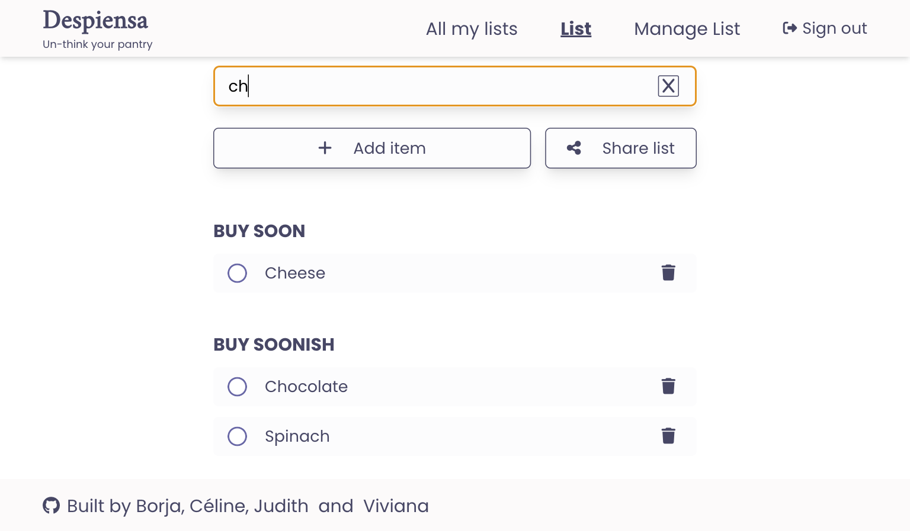

# Despiensa

A "smart" shopping list app that learns users' buying habits and helps them remember what they are likely to need to buy on their next trip to the store.
 

---

### Contents

- [Motivation and project details](#motivation)
- [Quick start: How to use Despiensa](#quick-start-how-to-use-despiensa)
- [Usage: Current features](#check-out-an-example)
- [Contributing to this project](#contributing-to-this-project)

---

## Motivation and project details

[The Collab Lab](https://the-collab-lab.codes/) supports early-career developers by providing an environment to gain practical experience through remote collaboration on real-world projects as part of an agile team.

This project is the result of the TCL-71 participation and was developed by [Celine](https://github.com/ocsiddisco), [Borja](https://github.com/borjaMarti), [Judith](https://github.com/BikeMouse), and [Viviana](https://github.com/vivitt).

We worked on this application from February to early April 2024, using React, Tailwind, and Firebase, with Figma employed to create our app's views.

## Quick start: How to use Despiensa

An email account is all that's needed to start using Despiensa. Once registered and signed in via Google, users can begin creating lists, adding items, and sharing their lists with others. Visit the following link to [start using Despiensa](https://tcl-71-smart-shopping-list.web.app/) now.

## Usage: Current features

### Create a list or chose one to use

When users log into the app, they are prompted to create a list if they are newcomers.
 

 
Otherwise, they can navigate to the list they want to use.

### Mark items as purchased

Once in the List view, users can interact with the items in the list. Each time a user buy the item, them mark it as purchased in the list. Over time, the app comes to understand the intervals at which users buy different items, and if an item is likely to be due to be bought soon, it rises to the top of the shopping list.
 

### Filter items to access them easier

Users can filter items using the input at the top.
 

### Manage List

In this view, users can manage the list they are currently using.

#### Add items

By clicking in the "Add item" button in the List view or in the "Manage List" link in the navigation bar, users can access the Manage List view and use the first input to add new items to their list.

#### Share list

By clicking in the "Share list" button in the List view or in the "Manage List" link in the navigation bar, users can access the Manage List view and use the second input to share a list with other registered users. When a list is shared with a user, they will find it in the All My List view.
 

## Contributing to this project

Contributions to this project are appreciated. If you find any issues or have suggestions for improvements, please feel free to submit a pull request or open an issue.

### Project set up

- clone this repo
- `npm install`
- `npm start`
- navigate to `localhost:3000` to see the project

Latest Long Term Support (LTS) version of Node is required to run this project locally

---

  
Made with 💜 by [Celine](https://github.com/ocsiddisco), [Borja](https://github.com/borjaMarti), [Judith](https://github.com/BikeMouse), and [Viviana](https://github.com/vivitt).

